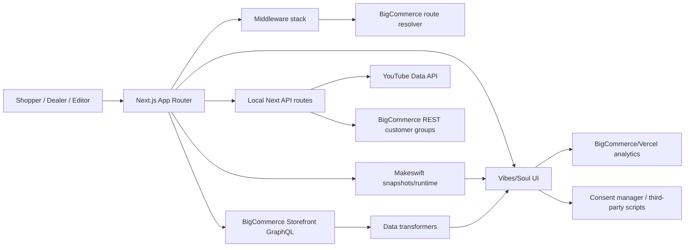

# Stack

## Related Specs

| Spec | Relevance |
|------|-----------|
| [Product Context](product-context.md) | Business context for stack decisions. |
| [Backend](backend.md) | How stack pieces are organized in the application. |
| [UI](ui.md) | Frontend/design-system technologies. |
| [Content Management](content-management.md) | Makeswift runtime and editor integrations. |
| [Routing and SEO](routing-seo.md) | Next middleware and BigCommerce route resolution. |
| [Analytics and Compliance](analytics-and-compliance.md) | Third-party script, consent, and analytics technologies. |
| [Source Map](source-map.md) | Files supporting each stack claim. |

## Summary

| Layer | Technology | Role | Confidence |
|-------|------------|------|------------|
| Runtime/app framework | Next.js 15 App Router | Storefront routing, RSC, server actions, middleware, metadata, API routes. | Observed |
| UI runtime | React 19 | Component rendering, server/client component split, Suspense. | Observed |
| Package manager | pnpm 10 | Workspace package management. | Observed |
| Monorepo orchestration | Turborepo | Runs dev/build/lint/test/typecheck across packages. | Observed |
| Commerce platform | BigCommerce | Catalog, routes, redirects, cart, checkout, customer/account, blog, reviews, settings, sitemap/robots/favicon. | Observed |
| Commerce API | BigCommerce Storefront GraphQL API | Primary storefront data access through Catalyst client. | Observed |
| Visual CMS/editor | Makeswift | Homepage/catch-all pages, component snapshots, header/footer/theme, visual editor controls. | Observed |
| Design system | Vibes/Soul components | Product cards, PLP, PDP, forms, navigation, footer, carousel, slideshow, sections. | Observed |
| Styling | Tailwind CSS 3, CSS variables, Makeswift theme tokens | Responsive layout, utility classes, editable theme controls, brand tokens. | Observed |
| UI primitives | Radix UI | Dialog, dropdown, navigation menu, select, radio/checkbox/switch, tooltip. | Observed |
| Carousel | Embla Carousel | Slideshow, product/gallery/video/blog/brand carousels. | Observed |
| Forms | Conform, Zod | Product form, validation, server action result handling. | Observed |
| I18n | next-intl | Localized routes/messages, locale switcher, translations. | Observed |
| Auth | NextAuth beta + Catalyst auth helpers | Customer login/session, customer access token, account routes. | Observed |
| Query state | nuqs | URL search params for filters, sort, pagination, and product option selections. | Observed |
| Client data fetching | SWR | Makeswift client-side product/blog/YouTube/customer group components. | Observed |
| Image optimization | Next image via Catalyst `Image` wrapper | Product, hero, CMS, video thumbnail, and catalog images. | Observed |
| Deployment/metrics | Vercel, Vercel Analytics, Speed Insights | Runtime target and optional hosted analytics/performance insights. | Observed |
| Cache/KV | In-memory, Upstash, Vercel runtime cache adapters | Route/status cache and runtime caching seams. | Observed |
| External media | YouTube Data API | Fetches video metadata for CMS YouTube components. | Observed |
| Marketing | Constant Contact widget script | Popup sign-up behavior plus newsletter-page CTA. | Observed |

## Repository and Commands

| Command | Purpose |
|---------|---------|
| `pnpm run dev` | Loads `.env.local` and runs Turbo dev tasks. |
| `pnpm run build` | Loads `.env.local` and runs Turbo build tasks. |
| `pnpm run lint` | Loads `.env.local` and runs lint tasks. |
| `pnpm run test` | Runs workspace tests through Turbo. |
| `pnpm run typecheck` | Runs TypeScript checks through Turbo. |

The primary storefront package is `core/package.json` (`@bigcommerce/catalyst-makeswift`). Root `package.json` contains workspace-level scripts and shared tooling.

## Environment Variables

| Variable | Used By | Required For | Notes |
|----------|---------|--------------|-------|
| `BIGCOMMERCE_STORE_HASH` | BigCommerce client/settings, metadata | Commerce API access and metadata. | Observed in root metadata output. |
| `BIGCOMMERCE_ACCESS_TOKEN` | Customer groups API route | Fetching all customer groups for Makeswift editor options. | Missing token returns 403 with setup note. |
| `MAKESWIFT_SITE_API_KEY` | Makeswift client/API handler | Makeswift page/component snapshots and editor route. | Enforced with `strict(...)`. |
| `NEXT_PUBLIC_MAKESWIFT_API_ORIGIN` / `MAKESWIFT_API_ORIGIN` | Makeswift client/provider/API handler | Custom Makeswift API origin. | Public variable preferred. |
| `NEXT_PUBLIC_MAKESWIFT_APP_ORIGIN` / `MAKESWIFT_APP_ORIGIN` | Makeswift provider/API handler/CSP | Custom editor app origin and frame ancestor. | Public variable preferred. |
| `YOUTUBE_API_KEY` | `/api/youtube/video`, `/api/youtube/videos` | YouTube metadata components. | API routes return 500 if missing. |
| `NEXT_PUBLIC_METAFIELDS_NAMESPACE` | PDP streamable product query | Product metafield namespace; defaults to `Info`. | Separate explicit `Info`/`Compat` queries also exist. |
| `NEXTAUTH_URL` / `VERCEL_PROJECT_PRODUCTION_URL` | Robots base URL | Sitemap URL in robots.txt. | Falls back to localhost in parsing helper. |
| `VERCEL`, `DISABLE_VERCEL_ANALYTICS`, `DISABLE_VERCEL_SPEED_INSIGHTS` | Root layout | Hosted analytics/performance scripts. | Only active when `VERCEL === '1'`. |
| `TRAILING_SLASH` | Route middleware | Redirect comparison/trailing-slash handling. | `false` disables trailing slash in comparisons. |

## Data Flow

## Application Stack Boundaries

| Boundary | App Responsibility | Framework/Service Responsibility |
|----------|--------------------|----------------------------------|
| BigCommerce catalog | Transform and present catalog data; add app-specific category/PDP behavior. | Own product/category/brand/blog/settings/cart/customer data. |
| BigCommerce routing | Use resolved entity type to rewrite to internal app routes; add app-specific legacy product redirect. | Store redirect configuration and route node resolution. |
| Makeswift | Register app-specific components and wrap header/footer/theme/product detail for editing. | Store remote page/component snapshots and editor experience. |
| Vibes/Soul | Customize component props/styles and app composition. | Provide base UI primitives/sections. |
| YouTube | Provide API proxy and presentation components. | Own video metadata and thumbnails. |
| Constant Contact | Load popup script and provide CTA. | Own popup behavior/forms after script loads. |

## Decisions

| Decision | Alternatives Considered | Why This Choice | Confidence |
|----------|------------------------|-----------------|------------|
| Use BigCommerce as the system of record for commerce and content settings. | Local database; custom CMS-owned catalog; separate ecommerce backend. | Current code is Catalyst and all commerce data flows from BigCommerce APIs. | Observed |
| Use Makeswift for editable content and global surfaces. | Code-only pages; BigCommerce Page Builder only; another CMS. | Current homepage/catch-all pages and site header/footer/theme use Makeswift snapshots. | Observed |
| Keep app-specific API routes as thin proxies/transforms. | Direct browser calls to third-party APIs; large custom backend. | API routes mostly validate/query/transform BigCommerce or YouTube data for components. | Observed |
| Prefer Streamable/Suspense for server-rendered commerce data. | Fully client-side fetching; blocking all data before render. | Catalyst/Vibes architecture uses `Streamable` extensively for PLP/PDP. | Observed |

